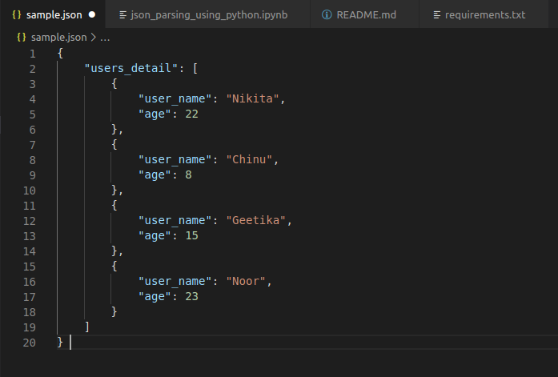

# Parse JSON using Python3

In this repository, I have covered the following JSON file operations :

* Create
* Read
* Write
* Update 
* Fetch data of particular user/item

## Install requirements
```pip3 install -r requirements.txt```

## Files

* json_parsing_using_python.ipynb
- This Jupyter notebook contains the JSON operations mentioned above.

* sample.json :
- This is the sample file created to execute mentioned operations.


